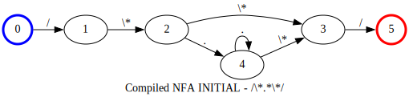
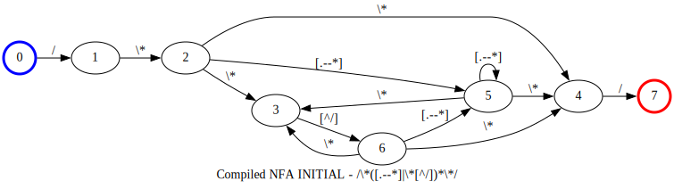

<!-- markdownlint-disable first-line-h1 -->

[](https://github.com/jsinger67/scnr/actions/workflows/rust.yml)
[](https://docs.rs/scnr)
[](https://crates.io/crates/scnr)

<!-- markdownlint-enable first-line-h1 -->

# About `scnr`

This crate provides a scanner/lexer with sufficient regex support and minimal compile time.
The scanners support multiple scanner modes out of the box.
Scanner modes are known from Lex/Flex as
[Start conditions](https://www.cs.princeton.edu/~appel/modern/c/software/flex/flex.html#SEC11).

It is still in an early phase and not ready for production yet. Early adopters can quite safely use
it. In case you find a bug, please report it.

## How to use it

```rust
use scnr::ScannerBuilder;

static PATTERNS: &[&str] = &[
    r";",                          // Semicolon
    r"0|[1-9][0-9]*",              // Number
    r"//.*(\r\n|\r|\n)",           // Line comment
    r"/\*([.\r\n--*]|\*[^/])*\*/", // Block comment
    r"[a-zA-Z_]\w*",               // Identifier
    r"=",                          // Assignment
];

const INPUT: &str = r#"
// This is a comment
a = 10;
b = 20;
/* This is a block comment
   that spans multiple lines */
c = a;
"#;

fn main() {
    let scanner = ScannerBuilder::new()
        .add_patterns(PATTERNS)
        .build()
        .expect("ScannerBuilder error");
    let find_iter = scanner.find_iter(INPUT);
    for ma in find_iter {
        println!("Match: {:?}: '{}'", ma, &INPUT[ma.span().range()]);
    }
}
```

## Guard rails

* The scanners should be built quickly.
* Scanners can be based on DFAs or on NFAs to best fit the desired behavior
* The scanners only support `&str`, i.e. patterns are of type `&str` and the input is of type
`&str`. `scnr` focuses on programming languages rather than byte sequences.

## Not supported regex features

We don't support **anchored matches**, i.e. `^`, `$`, `\b`, `\B`, `\A`, `\z` and so on, are not
available.
Mostly, this can be tolerated because of the overall properties of the scanner, and especially the
fact that the longest match will win mitigates the need for such anchors.

To elaborate this a bit more:

Lets say you have a pattern for the keyword `if` and a pattern for an identifier
`/[a-zA-Z_][a-zA-Z0-9_]*/`. Both could match the `if` but the keyword will win if you have its
pattern inserted **before** the pattern of the identifier. If the scanner encounters an input like,
e.g. `ifi` the identifier will match because of the longest match rule. With these guaranties it is
simply unnecessary to declare the keyword 'if' with attached word boundaries (`\b`).

Also we currently don't support **flags** (`i`, `m`, `s`, `R`, `U`, `u`, `x`), like in
```r"(?i)a+(?-i)b+"```.
I need to evaluate if this is a problem, but at the moment I belief that this is tolerable.

There is no need for **capture groups** in the context of token matching, so I see no necessity to
implement this feature.

## Not supported Flex features

As follows from the above regex restrictions anchors `^` and `$` are currently not supported.

## Lookahead

As of version 0.4.0 `scnr` supports *trailing contexts*, like in Flex, e.g. ```ab/cd```.

Additionally to Flex `scnr` supports not only positive lookahead but also negative lookahead.

The configuration of these look ahead constraints can be done via the `Pattern` struct which now
contains an optional member `lookahead`. The inner type of the Option is `Lookahead` that contains
a patter string and a flag that determines whether the lookahead pattern should match (positive
lookahead) or not match (negative lookahead).

To configure a scanner with patterns that contain lookahead expressions you have to use 
`add_scanner_mode` or `add_scanner_modes` of the `ScannerBuilder`.

With the help of a positive lookahead you can define a semantic like
```
match pattern R only if it is followed by pattern S
```
On the other hand with a negative lookahead you can define a semantic like
```
match pattern R only if it is NOT followed by pattern S
```

The lookahead patterns denoted above as `S` are not considered as part of the matched string.

## Scanner can use either DFAs or NFAs

As of version 0.4.0 `scnr` can work in two different modes.

### DFA Mode

In this mode the scanner uses *minimized DFAs* in which all repetition patterns like `*` and `+` are
matched **non-greedily**.

DFA based scanners are faster than NFA based scanners but can't handle overlapping character classes
correctly. `scnr` doesn't have a means to build distinct character classes because of its approach
to use match functions for character classes and because of its goal to have minimal compile time.

The compile time of DFA based scanners is slightly longer than the one of NFA based scanners because
of the more costly DFA minimization.

### NFA Mode

The other mode works with *compact NFAs* in which all repetition patterns like `*` and `+` are
matches **greedily**.

NFA based scanners have shorter build time than DFA based scanners but a slightly longer match time.

The biggest advantage over DFAs is that NFAs can handle overlapping character classes because of
their different matching algorithm.

This mean that `/u\d{2}|[a-z][a-z0-9]+/` matches a string `u1x` completely over the second
alternation. A DFA could miss matching this string if the first alternation is tried first and fails
when seeing the `x` while expecting a second digit.
The problem here is that the DFA can match the first character `u` against both alternations'
start, `/u/` and `/[a-z]/`.

To get an NFA based scanner call `use_nfa()` on the scanner builder before calling `build()`.

```rust
let scanner = ScannerBuilder::new()
    .add_scanner_modes(&*MODES)
    .use_nfa()  // <==
    .build()
    .unwrap();
let find_iter = scanner.find_iter(INPUT).with_positions();
let matches: Vec<MatchExt> = find_iter.collect();
```

As a rule of thumb, I would recommend preferring NFA-based scanners over DFA-based scanners as they
mostly work as expected. If you know what to do to avoid overlapping character classes you can use
DFA mode and take advantage of the improved performance.

## Greediness of repetitions

Some words about greediness.

The normal Lex/Flex POSIX matching is greedy. It somewhat follows the longest match rule, but causes
some backtracking overhead during scanner runtime.

### Exit conditions on repetitions

Using DFAs you have a small performance gain but you have to be very specific about the content of
the repeated expression in that sense that the transition from a repeated expression to the
following part of the regular expression should be unambiguous.

Lets have a look at this regex with a repeated expression of `.` in the middle.

```regex
/\*.*\*/
```

The DFA for this looks like this:


The point is the state 3 where it depends on the input whether to continue the repetition or to
proceed with the following part, here state 1.
But the `.` matches `*` too which leads to an ambiguity that contradicts the general notion of
deterministic finite automata. How this is resolved depends on the implementation of the scanner
runtime. This should be avoided at all costs.

So, the first thing we can do is to be more precise about the content of the repeated expression.
We can remove the `*` from the `.`:

```regex
/\*[.--*]*\*/
```


This looks more deterministic, but now we reveal another problem, which was actually inherent
already in the first variant.

Scanning the following input will mess up the match:

```
/* a* */
```

The scanner enters state 1 when reading the `*` after the `a` and then fails on matching the space
while instead expecting a `/`. The reason is that the repeated expression doesn't care about the
part that follows it.

So, we need to become more specific about this aspect, too:

```regex
/\*([.--*]|\*[^/])*\*/
```

This says that the repeated expression is any character except `*`, or a `*` followed by a character
other than `/`.


This solution will do the job perfectly, because its automaton is able the return to the repetition
if the exit condition fails.

### Behavior in NFA mode

The NFA is able to match comments with the first given regular expression `/\*.*\*/`, but greedily,
because during its simulation it can be in more than one state simultaneously.
The greediness can be explained by the fact that the NFA in this example stays in state 4 too (among
other states in which it can be) and so it can advance behind any end comment sequence.



For completeness only, the non-greedy version `/\*([.--*]|\*[^/])*\*/` in NFA form looks like this:



This NFA can match *hard* strings like `/* *Comment 1* */ `, but we needed to be explicit here too.
Perhaps, in the future `scnr` will provide non-greedy repetitions in NFA mode as well.

### Scanner modes

A more flexible but also a little more complex approach to the above mentioned obstacles like
ambiguity on exit conditions and handling of following expressions in the repeated expressions is
to introduce a second scanner mode that is entered on the **comment start** `/\\*`, then handles all
tokens inside a comment and enters INITIAL mode on the **comment end** `\\*/` again.

The scanner modes can be defined for instance in json:

```json
[
  {
    "name": "INITIAL",
    "patterns": [
      { "pattern": "/\\*", "token_type": 1}
    ],
    "transitions": [[1, 1]]
  },
  {
    "name": "COMMENT",
    "patterns": [
      { "pattern": "\\*/", "token_type": 2},
      { "pattern": "[.\\r\\n]", "token_type": 3}
    ],
    "transitions": [[2, 0]]
  }
]
```

> Note, that this kind of JSON data can be deserialized to `Vec<ScannerMode>` thanks to `serde` and
`serde_json`.

Here you see two modes. The scanner always starts in mode 0, usually INITIAL. When encountering a
token type 1, **comment start**, it switches to mode 1, COMMENT. Here the **comment end** token type
2 has higher precedence than the `[.\\r\\n]` token 3, simply by having a lower index in the patterns
slice. On token 2 it switches to mode INITIAL again. All other tokens are covered by token type 3,
**comment content**.

In this scenario you can imagine that the parser knows that token type 3 is **comment content** and
can handle it accordingly.
