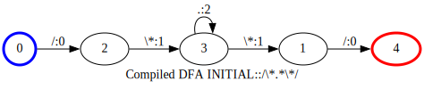
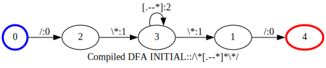
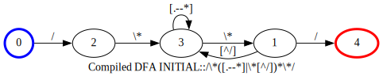

<!-- markdownlint-disable first-line-h1 -->

[](https://github.com/jsinger67/scnr/actions/workflows/rust.yml)
[](https://docs.rs/scnr)
[](https://crates.io/crates/scnr)

<!-- markdownlint-enable first-line-h1 -->

# About `scnr`

This crate provides a scanner/lexer with sufficient regex support and minimal compile time.
The scanners support multiple scanner modes out of the box.
Scanner modes are known from Lex/Flex as
[Start conditions](https://www.cs.princeton.edu/~appel/modern/c/software/flex/flex.html#SEC11).

It is still in an early phase and not ready for production yet. Early adopters can quite safely use
it. In case you find a bug, please report it.

## How to use it

```rust
use scnr::ScannerBuilder;

static PATTERNS: &[&str] = &[
    r";",                          // Semicolon
    r"0|[1-9][0-9]*",              // Number
    r"//.*(\r\n|\r|\n)",           // Line comment
    r"/\*([.\r\n--*]|\*[^/])*\*/", // Block comment
    r"[a-zA-Z_]\w*",               // Identifier
    r"=",                          // Assignment
];

const INPUT: &str = r#"
// This is a comment
a = 10;
b = 20;
/* This is a block comment
   that spans multiple lines */
c = a;
"#;

fn main() {
    let scanner = ScannerBuilder::new()
        .add_patterns(PATTERNS)
        .build()
        .expect("ScannerBuilder error");
    let find_iter = scanner.find_iter(INPUT);
    for ma in find_iter {
        println!("Match: {:?}: '{}'", ma, &INPUT[ma.span().range()]);
    }
}
```

## Guard rails

* The scanners should be built quickly.
* The scanners base solely on DFAs, no backtracking is implemented
* The scanners will probably never support `u8`, i.e. patterns are of type convertible to `&str` and
the input is of type convertible to `&str`. We concentrate on programming languages rather than byte
sequences.

## Not supported regex features

We don't support **anchored matches**, i.e. ^, $, \b, \B, \A, \z and so on, are not available.
Mostly, this can be tolerated because of the overall properties of the scanner, and especially the
fact that the longest match will win mitigates the need for such anchors.

To elaborate this a bit more:

Lets say you have a pattern for the keyword 'if' and a pattern for an identifier
/[a-zA-Z_][a-zA-Z0-9_]*/. Both could match the 'if' but the keyword will win iff you have its
pattern inserted before the pattern of the identifier. If the scanner encounters an input like,
e.g. 'ifi' the identifier will match because of the longest match rule. With these guaranties it is
simply unnecessary to declare the keyword 'if' with attached word boundaries (\b).

Also we currently don't support **flags** (i, m, s, R, U, u, x), like in ```r"(?i)a+(?-i)b+"```.
I need to evaluate if this is a problem, but at the moment I belief that this is tolerable.

There is no need for **capture groups** in the context of token matching, so I see no necessity to
implement this feature.

## Not supported Flex features

Additional to the anchors ^ and $, *trailing contexts*, like in ```ab/cd```, is currently not
supported because of the need to provide lookahead outside of the normal advance loop of the
character iterator. Although preparations are already made, we will postpone this as long as strong
needs arise.

## Greediness of repetitions

Some words about greediness.

The normal Lex/Flex POSIX matching is greedy. It some sort adheres to the longest match rule but
poses some overhead during backtracking on the scanner's runtime.

Since `scnr` works with minimized DFAs only (current situation, may change) it always matches
repetitions like * and + non-greedily.

### Exit conditions on repetitions

But you have to be very specific about the content of the repeated expression in that sense that
the transition from a repeated expression to the following part of the regular expression should be
unambiguous.

Lets have a look at this regex with a repeated expression of `.` in the middle.

```regex
/\*.*\*/
```

The DFA for this looks like this:



The point is the state 3 where it depends on the input whether to continue the repetition or to
proceed with the following part, here state 1.
But the `.` matches `*` too which introduces an ambiguity that contradicts the common notion of
deterministic finite automata. How this is resolved depends on the implementation of the scanner
runtime. This should clearly be avoided.

So, the first thing we can do is to be more precise about the content of the repeated expression.
We can remove the `*` from the `.`:

```regex
/\*[.--*]*\*/
```



This looks more deterministic, but now we reveal another problem, which was actually inherent
already in the first variant.

Scanning the following input will mess up the match:

```
/* a* */
```

The scanner enters state 1 when reading the `*` after the `a` and then fails on matching the space
while instead expecting a `/`. The reason is that the repeated expression doesn't care about the
part that follows it.

So, we need to become more specific about this aspect, too:

```regex
/\\*([.--*]|\\*[^/])*\\*/
```

This says that the repeated expression is any character except `*`, or a `*` followed by a character
other than `/`.




This solution will do the job perfectly, because its automaton is able the return to the repetition
if the exit condition fails.


### Scanner modes

A more flexible but also a little more complex approach to the above mentioned obstacles like
ambiguity on exit conditions and handling of following expressions in the repeated expressions is
to introduce a second scanner mode that is entered on the **comment start** `/\\*`, then handles all
tokens inside a comment and enters INITIAL mode on the **comment end** `\\*/` again.

The scanner modes can be defined for instance in json:

```json
[
  {
    "name": "INITIAL",
    "patterns": [["/\\*", 1]],
    "transitions": [[1, 1]]
  },
  {
    "name": "COMMENT",
    "patterns": [
      ["\\*/", 2],
      ["[.\\r\\n]", 3]
    ],
    "transitions": [[2, 0]]
  }
]
```

Here you see two modes. The scanner always starts in mode 0, usually INITIAL. When encountering a
token type 1, **comment start**, it switches to mode 1, COMMENT. Here the **comment end** token type
2 has higher precedence than the `[.\\r\\n]` token 2, simply by having a lower index in the patterns
slice. On token 2 it switches to mode INITIAL again. All other tokens are covered by token type 3,
**comment content**.

In this scenario you can imagine that the parser knows that token type 3 is **comment content** and
can handle it accordingly.
